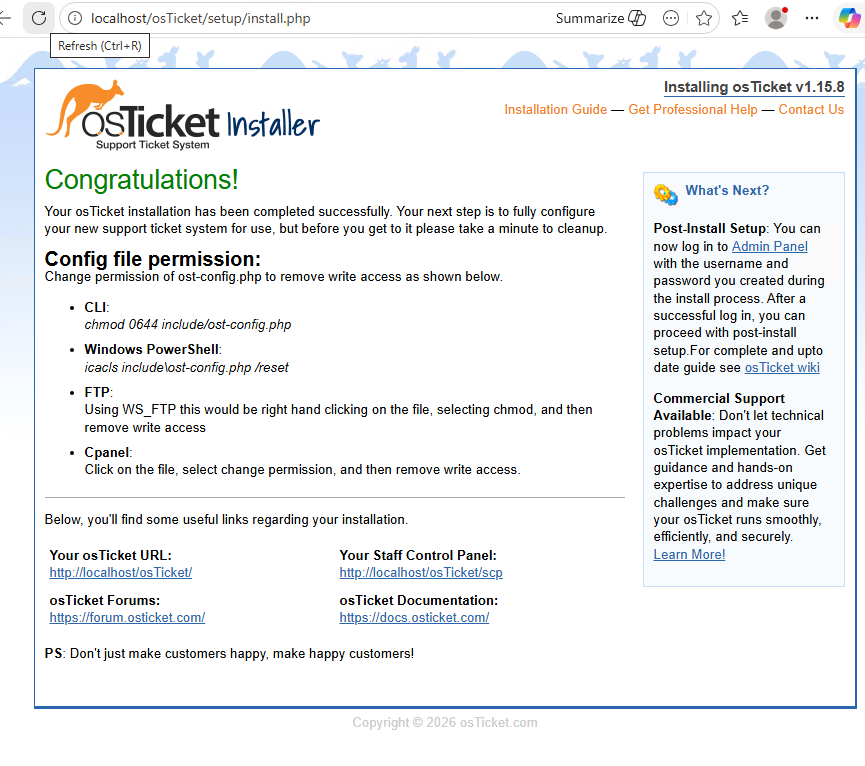
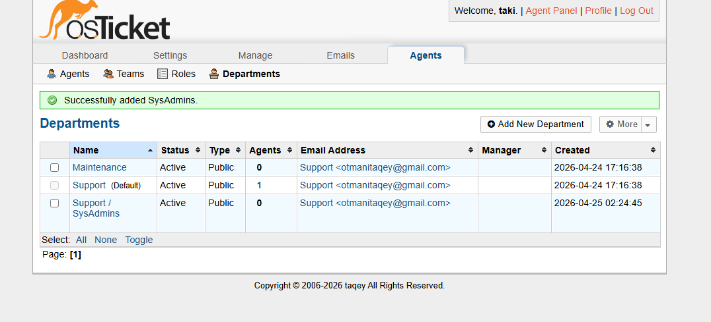

# Enterprise ITSM Implementation: osTicket Lifecycle & Azure AD Case Study

## Project Overview
This project demonstrates the deployment and end-to-end operational configuration of **osTicket**, an industry-standard open-source IT Service Management (ITSM) tool. The objective was to build a functional Service Desk environment capable of managing enterprise-level support workflows, SLAs, and cross-platform technical escalations.

The centerpiece of this portfolio is a **Root Cause Analysis (RCA) Case Study**, where I utilized osTicket to manage the lifecycle of a critical infrastructure failure involving Azure Active Directory and RDP access permissions.

---

## Technical Stack & Governance
* **Platform:** osTicket (ITSM)
* **Infrastructure Integration:** Microsoft Azure, Windows Server 2022 (AD DS)
* **ITSM Framework:** Incident Management, Service Level Agreements (SLAs), Help Topic Routing
* **Directory Services:** Active Directory Administrative Center (ADAC), Group Policy Management (GPMC)

---

## Operational Configuration

### 1. System Governance & Hierarchy
I provisioned the osTicket environment by defining a tiered support structure. This involved creating specialized **Departments** (SysAdmin, Support) and assigning granular **Roles** to ensure that sensitive internal data and system settings adhere to the principle of least privilege.

### 2. Workflow Automation & SLAs
To maintain organizational uptime, I engineered custom **Service Level Agreements (SLAs)** based on business priority. I implemented **Help Topics** (e.g., *Access Denied / Permissions*) to automate ticket routing, ensuring critical connectivity issues are bypassed to the System Administration team immediately.

---

## Technical Case Study: Resolving RDP Authentication Failure

### Phase 1: Incident Intake & Triage
* **User:** `Caw.Qovi`
* **Issue:** Remote Desktop Access Denied on workstation `Azure12`.
* **Action:** The ticket was flagged as an **Emergency SLA** via the automated routing system. The assigned agent immediately acknowledged the ticket to manage the user's expectations.

### Phase 2: Root Cause Analysis (RCA)
As the lead technician, I performed a backend audit of the **Active Directory Administrative Center (ADAC)**. I identified that the user object `Caw.Qovi` was missing from the **Remote Desktop Users** security group, which was the direct cause of the RDP failure.

### Phase 3: Remediation & Internal Documentation
The fix was implemented by restoring the user to the appropriate security group. All technical steps were documented using **Internal Notes** in osTicket. This ensures that the technical resolution is recorded for the knowledge base without cluttering the end-user's communication thread.

### Phase 4: Final Validation & Closure
Once the fix was applied, the agent sent a final response and successfully closed the ticket within the SLA window. The user confirmed the restoration of service by successfully logging into the workstation and verifying domain connectivity via ICMP.

---

## Key Takeaways
* **ITSM Mastery:** Successfully managed the full ticket lifecycle from intake to post-resolution analysis.
* **Infrastructure Bridging:** Demonstrated the ability to connect frontend support requests to backend Cloud/AD infrastructure.
* **Process Discipline:** Maintained clear communication with stakeholders while documenting technical remediation for internal audits.

---
**Developed by [Taki] | Azure Systems & ITSM Operations Portfolio**
